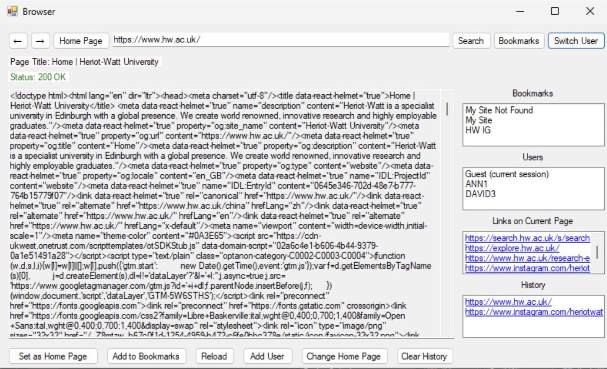

# Data Science, Machine Learning, and Software Engineering Projects

This repository contains a collection of projects developed as part of coursework and independent study in data science, machine learning, business analytics, and software engineering. These projects demonstrate practical applications of statistical modelling, machine learning algorithms, data visualization, and software development.

---

## Power BI Sales Dashboard

This project presents an interactive business intelligence dashboard built using Microsoft Power BI. The dashboard provides insights into sales performance, product categories, and regional trends through dynamic visualizations and KPI tracking.

Key highlights include revenue monitoring, product performance analysis, and time-based sales trends using interactive filters and drill-down functionality.

Tools used:
- Microsoft Power BI
- Data modelling
- DAX (Data Analysis Expressions)

---

## Machine Learning for Insurance Policy Prediction

This project develops machine learning models to predict whether customers will purchase a new car insurance policy. The dataset includes demographic information, vehicle details, and insurance history.

The analysis involves exploratory data analysis, feature engineering, handling class imbalance, and training classification models. Model performance is evaluated using metrics such as accuracy, precision, recall, and F1-score.

Tools used:
- Python
- Scikit-learn
- Pandas
- Matplotlib and Seaborn

---

## Bayesian Inference for Migration Modelling

This project applies Bayesian statistical methods to model the migration of seabirds between two islands over multiple years. The analysis derives probability distributions and conditional relationships between migration events using Bayesian inference.

The project focuses on deriving marginal and conditional probabilities, applying Bayes’ theorem, and interpreting posterior distributions.

Key concepts:
- Bayesian inference
- Conditional probability
- Probability distributions
- Statistical modelling

---

## Time Series Analysis of Crime Rates

This project performs time series modelling to analyse long-term trends in crime data. The study examines stationarity, variance stability, and autocorrelation in the data before selecting an appropriate ARIMA model for forecasting.

Data transformations such as log transformation and differencing are applied to achieve stationarity before model selection based on statistical criteria.

Tools used:
- R programming
- ARIMA modelling
- Time series diagnostics

---

## C# Web Browser Application

This project implements a simple web browser using C# and Windows Forms. The application demonstrates core networking concepts by sending HTTP requests and displaying HTML responses.

The browser includes features such as bookmark management, browsing history, homepage configuration, and hyperlink extraction from web pages.

Technologies used:
- C#
- .NET Framework
- Windows Forms
- SQLite database

---

## PowerHouse Smart Home Management System

PowerHouse is a smart home application designed to manage and monitor connected devices within a household. The system enables device automation, energy consumption monitoring, and remote control of smart devices.

The application supports multi-user access and integrates real-time device monitoring with scheduling and automation capabilities.

Technologies used:
- Web application frameworks
- Cloud databases
- IoT integration

---

## Skills Demonstrated

Across these projects, the following technical skills are demonstrated:

- Machine learning modelling
- Statistical analysis
- Bayesian inference
- Time series forecasting
- Data visualization
- Business intelligence dashboards
- Software engineering
- Database management
- Web and desktop application development

---
## Featured Projects

<table>
<tr>
<td width="50%">

### Power BI Sales Dashboard
Interactive business intelligence dashboard analysing sales performance using Power BI.

**Tools:** Power BI, DAX  

</td>

<td width="50%">

### Machine Learning Insurance Prediction
Predicts whether customers will purchase a new insurance policy using classification models.

**Tools:** Python, Scikit-learn  

</td>
</tr>

<tr>
<td width="50%">

### Bayesian Migration Model
Bayesian probability modelling of seabird migration between islands.

</td>

<td width="50%">

### C# Web Browser
A desktop browser built using .NET and Windows Forms with bookmarking and history.

</td>
</tr>
</table>

## Author

Ann Erinjeri
