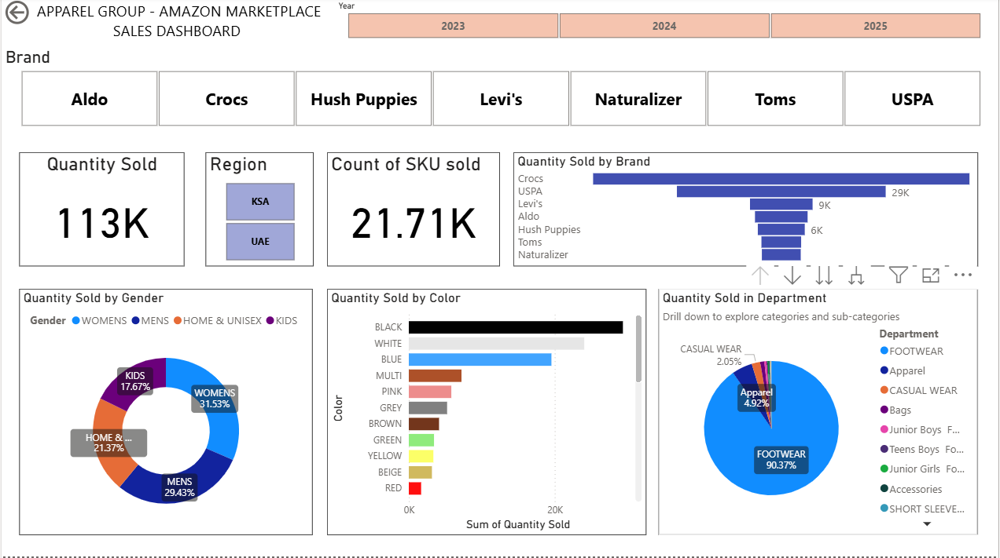

# Data Science & AI Projects Portfolio

This repository contains a collection of projects I have developed in the areas of:

- Data Science
- Machine Learning
- Artificial Intelligence
- Statistical Programming
- Data Visualization

The projects demonstrate practical applications of predictive modeling, data analytics, and dashboard development.

---

# Projects

## Power BI Sales Dashboard

Interactive dashboard for analysing sales performance and business KPIs.

Key features:

- Regional sales breakdown
- Revenue trends
- KPI monitoring
- Dynamic filtering

Preview:

Technologies:
- Power BI
- DAX
- Data modelling

Project folder:
PowerBI-Sales-Dashboard/

---

## Machine Learning – Breast Cancer Risk Prediction

Predictive modelling project using multiple machine learning algorithms.

Models implemented:

- Random Forest
- Support Vector Machine
- Gradient Boosting
- XGBoost
- CatBoost

Evaluation metrics:

- Accuracy
- Precision
- Recall
- F1 Score
- ROC AUC

Focus areas:

- Feature importance
- Model comparison
- Class imbalance handling

---

# Tools & Technologies

Python  
Scikit-learn  
Power BI  
Pandas  
NumPy  
XGBoost  
CatBoost  
Data Visualization  

---

# Author

Ann Erinjeri

Fields of interest:

- Machine Learning
- Artificial Intelligence
- Data Analytics
- Statistical Modeling
